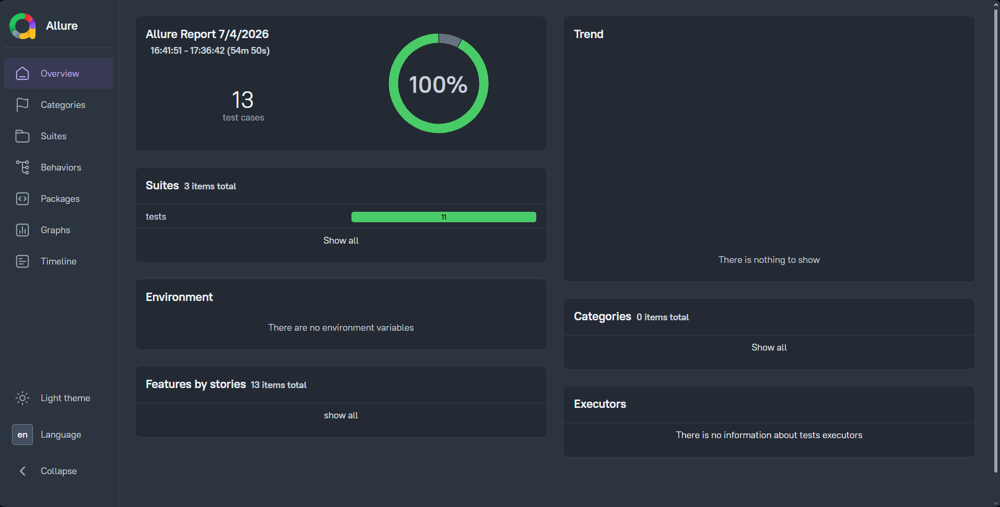

# E-commerce Test Automation Framework

End-to-end test automation framework for an e-commerce site, built with Selenium, Python, and Pytest, following the Page Object Model (POM) pattern.

## What it tests (11 cases)

- Successful login with valid credentials
- Failed login with incorrect credentials
- Login with a locked-out user
- Login with empty fields
- Adding multiple products to the cart
- Removing a product from the cart
- Sorting products by price
- Full checkout flow (login, cart, checkout, confirmation)
- Checkout with empty fields (error validation)
- Canceling checkout and returning to the cart
- Successful logout

## Tech stack

- Python 3.12
- Selenium WebDriver
- Pytest + pytest-rerunfailures (automatic retries for intermittent network failures)
- Allure Report (interactive visual reports)
- Page Object Model (POM)
- WebDriverWait / Expected Conditions (explicit waits for robust tests)
- webdriver-manager (automatic Chrome driver management)
- Automatic screenshot capture on failure, for debugging

## Visual reports with Allure

The project generates interactive reports with Allure Report, showing pass rate, test duration, and step-by-step details.

To generate it:

- pytest tests/
- allure serve allure-results

## Project structure

- pages: Page Objects (login, inventory, cart, checkout)
- tests: Test cases and pytest configuration
- reports: Automatic screenshots on failure
- allure-report.png: visual report screenshot
- requirements.txt
- pytest.ini
- README.md

## How to run it

- python -m venv venv
- venv\Scripts\Activate.ps1
- pip install -r requirements.txt
- pytest tests/ -v --reruns 2 --reruns-delay 2

## Result

11/11 tests passing, covering the critical e-commerce flow (authentication, cart management, checkout, and logout), with automatic retries to handle intermittent failures typical of end-to-end tests against real sites, and visual reports generated with Allure.

## Author

Camila Molina Toro, Systems Engineering student (UPB), focused on QA and software development.

LinkedIn: https://www.linkedin.com/in/camilamolinatoro

GitHub: https://github.com/camimolinatoro